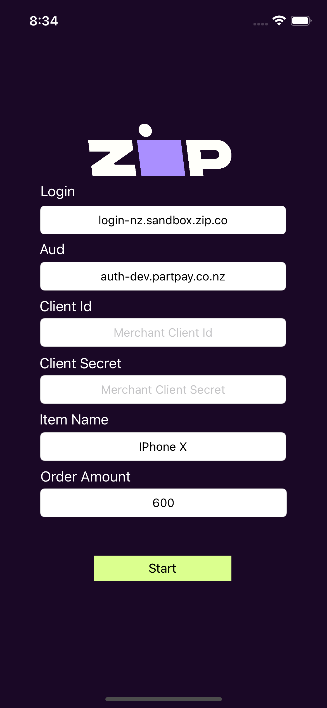

# ZipCheckout-iOS

An example on how to handle the Zip NZ checkout flow from iOS


## Prerequisites

* Xcode 12.4 or later
* iOS 14.4 or later
* OS X v11.11 or later
* Valid sandbox merchant configuration via the [Zip NZ onboarding process](https://zip.co/nz/for-merchants/#getting-started)

## Running the App

Ideally - run the app inside an IPhone X (and above) simulator for ease of use. 

Most of the input values are defaulted at the start page (and inside the code). Feel free to experiment by changing the values to meet your needs

The only variables that you need to provide are your merchant client id and merchant client secret, provided by the [merchant onboarding process]((https://zip.co/nz/for-merchants/#getting-started))


## Running through checkout

### Creating a test account

If you haven't got an account already, you can create a test account with dummy information as documented here:

https://docs-nz.zip.co/merchant-api/testing#customer-account

### Existing accounts

If you have already got a test account, you can simply login with the same details. Ensure the account has sufficient spend by managing it on the online [Customer Portal](https://sandbox.zip.co/nz/portal)

## Catching Redirects

On order completion, the webview will redirect to a provided success / failure url

Checkout.Swift:
```swift
private var _redirectSuccessUrl: String = "https://sandbox.zip.co/nz/api?yay=true"
private var _redirectFailureUrl: String = "https://sandbox.zip.co/nz/api?yay=false
```

By intercepting the navigation actions via

(https://developer.apple.com/documentation/webkit/wknavigationdelegate/1455641-webview)
```
 public func webView(
    _ webView: WKWebView, decidePolicyFor navigationAction: WKNavigationAction,
    decisionHandler: @escaping (WKNavigationActionPolicy) -> Swift.Void
  ){}
```
We can see when either the SuccessUrl or FailureUrl are hit and determine what state the order has reached. In this example, we display a popup in the parent controller to notify the user on their order status


## Trouble shooting

Having trouble? Reach out to the Zip NZ Team or _checkout_ our [full documentation](https://docs-nz.zip.co/)

